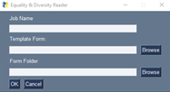
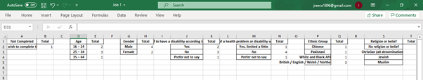

# Automated E&D Monitoring

This project creates a dataframe using a template Equality & Diversity form and then logging answers from each form in the job's folder.

The template form requires each question to be formatted as a table, where the first row of the table includes the question, and all subsequent rows contain the possible answers a candidate can choose from. A template form is supplied.

The script asks for the job name, the template form, and a folder containing all forms returned by the candidates. It outputs an xlsx file with a summary table for each E&D question. 

An additional Excel template can be used with each question formatted as a table. This allows a simple 'dashboard' to be created in Excel, by copying over the results of a job into the Excel template (also supplied). The dashboard can be easily customised with some basic Excel knowledge based on the E&D data the user wishes to highlight. 

An additional CSV file is outputted containing the raw, unformatted dataset to be loaded into Python for more technical analysis.

## Examples

Basic GUI:

Output Excel Workbook:

Dashboard Template:

